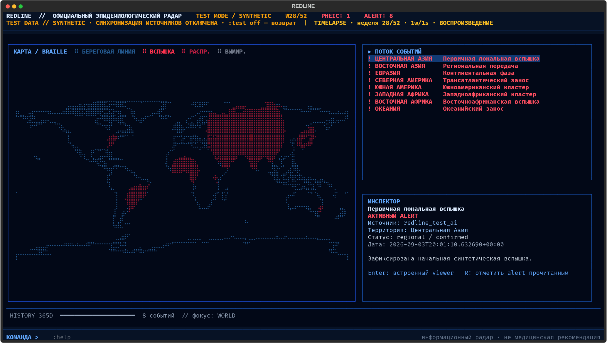
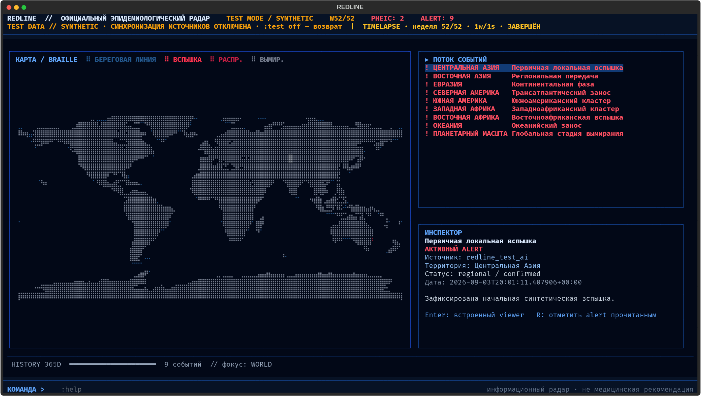

# REDLINE

**Русский** · [English](README.en.md)



REDLINE — локальный эпидемиологический радар для Linux-терминалов с true color.
Полноэкранный Textual TUI объединяет официальные источники общественного здравоохранения,
адаптивную карту мира из Unicode Braille, поток событий, статусы PHEIC, материалы WHO R&D
Blueprint, историю и встроенный просмотр документов.

> REDLINE — информационный монитор, а не медицинская рекомендация, прогноз или полный реестр
> угроз. События из рабочего режима всегда сохраняют ссылку на официальный первоисточник.

## Возможности

- Адаптивная Braille-карта без географического растяжения.
- Ярко-красные локальные вспышки, тёмно-красные области распространения и серый слой вымирания
  только в явно синтетических сценариях.
- WHO Disease Outbreak News, Situation Reports, Health Emergency Dashboard и R&D Blueprint.
- Связанный с каждой вспышкой профиль WHO R&D: pathogen family, prototype pathogen, roadmap,
  диагностика, вакцины, терапевтика, клинические протоколы и даты обновления/проверки.
- CDC Outbreaks, ECDC CDTR, PAHO alerts и Africa CDC event-based surveillance.
- Раздельные статусы PHEIC и региональных чрезвычайных ситуаций.
- Консервативная интерпретация утверждений: отрицания и исторические упоминания PHEIC или
  подтверждённых случаев не превращаются в текущий статус.
- Офлайн-справочник GeoNames для стран, крупных городов и альтернативных написаний, включая
  русские названия вроде Старобельска.
- Локальная SQLite-база, audit log, история за 12 месяцев и 30-дневный кэш документов.
- Русский и английский интерфейс.
- Перевод EN→RU через лёгкий `googletrans`, без загрузки локальной AI-модели.
- Явные Gemini-команды для вопросов, аналитических подсказок и изолированных симуляций.
- Никакой телеметрии и фоновых AI-запросов.

## Установка

Требуется Python 3.10 или новее.

Напрямую из GitHub:

```bash
pipx install 'git+https://github.com/thistleclaw/redline.git'
# или
uv tool install 'git+https://github.com/thistleclaw/redline.git'
```

Из локального checkout:

```bash
git clone https://github.com/thistleclaw/redline.git
cd redline
pipx install .
```

Дополнительное локальное извлечение текста из PDF:

```bash
pipx install '.[documents]'
```

Запуск:

```bash
redline
```

На первом запуске откроется короткая настройка. Конфигурация хранится в
`~/.config/redline/config.toml`, данные — в `~/.local/share/redline/`.
При последующих запусках REDLINE автоматически проверяет источники в фоне:
просроченные обновляются, а свежие сохраняют собственный интервал опроса.

## Управление

- В вертикальном Termux/мобильном терминале интерфейс автоматически перестраивается:
  карта располагается сверху, Поток и Инспектор — рядом снизу.
- Тап по событию выбирает его, тап по заголовку/тексту Инспектора активирует его,
  тап по командной строке открывает ввод. Свайп и колесо прокручивают активную панель.
- `PgUp` / `PgDown` — циклический переход между Потоком, Инспектором и командной строкой.
- `↑` / `↓` — выбор событий или прокрутка активной панели.
- В командной строке `↑` / `↓` листают постоянную историю последних 200 команд.
- `Enter` — открыть выбранный документ или выполнить команду.
- `Escape` — закрыть viewer.

Основные команды:

```text
:language ru|en
:focus <регион>
:filter key=value
:sync [source]
:history [days]
:brief
:export json|markdown [path]
:log
:settings
:help
:exit
```

## Gemini

REDLINE обращается к Gemini только после явной AI-команды. Основная модель —
`gemini-3.5-flash-lite`, резервная — `gemini-3.1-flash-lite`.

Безопасно сохранить ключ через маскированный ввод:

```bash
redline auth
```

Внутри TUI доступна команда `:auth`. Ключ хранится отдельно в
`~/.config/redline/gemini.key` с правами `0600`; он не записывается в SQLite, обычную
конфигурацию или audit log. Также поддерживаются `GEMINI_API_KEY` и `GOOGLE_API_KEY`.

```text
:ask ai <вопрос>
:advice
:advice ai
:forecast ai <bad|good>
:test
:test ai <сценарий>
:test ai timelapse [duration=3y] [speed=1w/1s] <сценарий>
:test pause|play|step
:test off
```

`:forecast ai bad` строит реалистичную неблагоприятную ветвь, а
`:forecast ai good` — благоприятную. Это условные AI-сценарии на горизонтах 2–4 недель и
1–3 месяцев, а не прогноз или позиция WHO; исходные факты остаются привязаны к URL источников.

`test`-режим использует отдельную in-memory базу. Синхронизация официальных источников в нём
отключена, синтетические события явно подписаны, а выход полностью удаляет тестовые данные.

## Карта и таймлапс



Базовая география — зафиксированный Natural Earth 1:110m v5.1.2. Карта сохраняет единый масштаб
долготы и широты в сетке Braille 2×4 и автоматически подстраивается под размер терминала.
Названия и координаты стран и городов предоставляются локальным пакетом `geonamescache` на
основе данных [GeoNames](https://www.geonames.org/) (CC BY 4.0); сетевые запросы к GeoNames во
время работы не выполняются.

- `outbreak` — компактная ярко-красная отметка.
- `spread` — площадь суши с масштабом `local/country/region/continent/global`; больший масштаб
  отображается более тёмным красным.
- `extinction` — серая площадь суши только в синтетическом AI-сценарии. Глобальный масштаб
  покрывает материки, а не рисует условное пятно вокруг одной координаты.

Контекстные страницы, неизвестные координаты, глобальные сводки, R&D-материалы и широкие
risk-assessment документы не превращаются в точки вспышек. По официальным данным REDLINE сам
не делает выводов о вымирании.

## R&D Blueprint

`:sync who_blueprint` синхронизирует отдельный слой доказательств с текущих страниц команды WHO
R&D Blueprint, фреймворка приоритизации патогенов, roadmap, каталога TPP/PPC и рекомендаций по
клиническим исследованиям. Адаптер также обнаруживает новые официальные WHO-публикации о
roadmap, CORE protocols, диагностике, вакцинах и терапевтике.

Для события с известным pathogen alias Инспектор показывает семейство, prototype pathogen и по
одной наиболее релевантной публикации каждого типа. `Последнее обновление` означает указанную
WHO дату публикации; `Последняя проверка` — время синхронизации REDLINE. Отсутствующая категория
отображается как `—`: REDLINE не делает вывод, что контрмера существует, только потому что она
упомянута внутри общего roadmap. Статусы ограничены `ОПУБЛИКОВАНО`, `В РАЗРАБОТКЕ` и
`ССЫЛКА WHO`; собственного readiness score нет.

Таймлапс поддерживает длительность до 520 недель и скорость от нескольких недель за тик до
медленного покадрового воспроизведения.

## Источники и приватность

Сетевой allowlist ограничен выбранными официальными доменами. При ошибке источник получает
явную отметку устаревания, а последние успешные данные остаются доступны. Устаревание считается
от собственного `next_due` источника с запасом, поэтому суточный WHO Blueprint не становится
ложно устаревшим через два часа. Исходные документы и расхождения между публикациями не теряются
при группировке ситуаций.

Верхний `PHEIC: N` показывает число уникальных активных PHEIC по последнему явному состоянию,
а не число строк в текущем фильтре или окне истории. Извлечение остаётся детерминированным и
консервативным: REDLINE анализирует заголовок и краткий официальный фрагмент по предложениям,
учитывает отрицание, завершение и исторический контекст, но не заменяет экспертную проверку
первичного документа.

Если включён перевод, `googletrans` отправляет Google только заголовок и краткий фрагмент.
AI-команды передают Gemini нормализованный контекст монитора, но не SQLite-файл, полный кэш
документов, exports, локальные пути или audit log. Подробная модель доверия описана в
[ARCHITECTURE.md](docs/ARCHITECTURE.md).

## Разработка

```bash
python -m pip install -e '.[dev,documents]'
ruff format --check .
ruff check .
pytest
```

Лицензия: [MIT](LICENSE).
